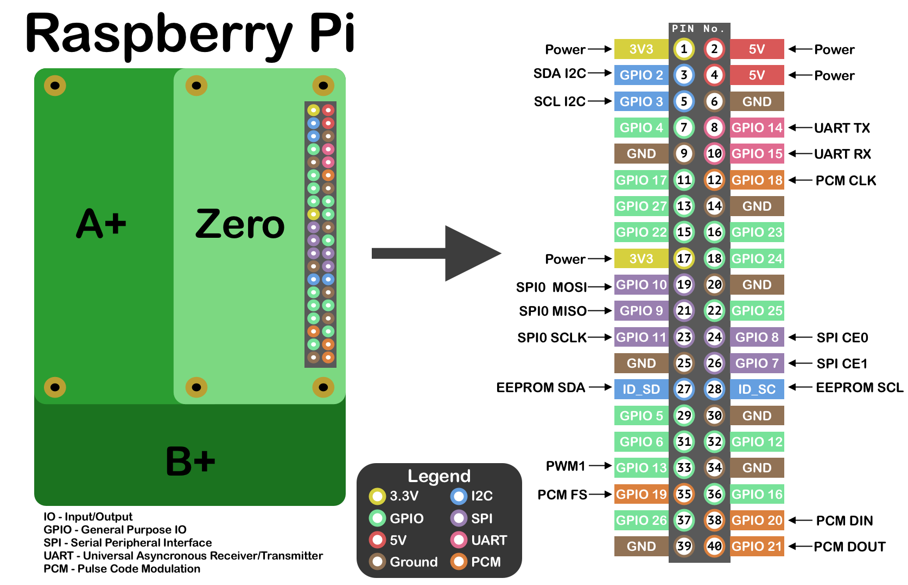

## README

This repository stores the code used on YouTube videos about Raspberry Pi.

_Para ver este README en castellano haz click [aquí](README_es.md)_

## Projects

* 01 Basic 2-PIN LED: [code](01_basic_led/01_basic_led.py)&nbsp;&nbsp;-&nbsp;&nbsp;[circuit](01_basic_led/circuit_basic_led.png)

* 02 RGB LED: [code](02_rgb_led/02_rgb_led.py)&nbsp;&nbsp;-&nbsp;&nbsp;[circuit](02_rgb_led/circuit_rgb_led.png)

* 03 Button: [code](03_button/03_button.py)&nbsp;&nbsp;-&nbsp;&nbsp;[circuit](03_button/circuit_button.png)

* 04 7Led LMS 5161AS: [code](04_7led_cathode/04_7led_cathode.py)&nbsp;&nbsp;-&nbsp;&nbsp;[circuit](04_7led_cathode/circuit_7led_cathode.png)

* 05 RGB LED + button: [code](05_rgb_led_button/05_rgb_led_button.py)&nbsp;&nbsp;-&nbsp;&nbsp;[circuit](05_rgb_led_button/circuit_rgb_btn.png)

* 06 Temperature sensor LM35 + MCP3008: [code](06_lm35_mcp3008/06_lm35_mcp3008.py)&nbsp;&nbsp;-&nbsp;&nbsp;[circuit](06_lm35_mcp3008/circuit_lm35_mcp3008.png)

* 07 Temperature sensor DS18B20 (KY-001): [code](07_ky001_temp/07_ky001_temp.py)&nbsp;&nbsp;-&nbsp;&nbsp;[circuit](07_ky001_temp/07_ky001_circuit.png)

* 08 Vibration sensor (KY-002): [code](08_ky002_vibration/08_ky002_vibration.py)&nbsp;&nbsp;-&nbsp;&nbsp;[circuit](08_ky002_vibration/08_ky002_circuit.png)

* 09 Magnetic sensor (KY-003): [code](09_ky003_magnetic/09_ky003_magnetic.py)&nbsp;&nbsp;-&nbsp;&nbsp;[circuit](09_ky003_magnetic/09_ky003_circuit.png)

* 10 Passive Buzzer (KY-006): [code](10_ky006_pbuzzer/10_ky006_pbuzzer.py)&nbsp;&nbsp;-&nbsp;&nbsp;[circuit](10_ky006_pbuzzer/10_ky006_circuit.png)

* 11 RGB SMD LED (KY-009): [code](11_ky009_rgb_smd_led/11_rgb_smd_led.py)&nbsp;&nbsp;-&nbsp;&nbsp;[circuit](11_ky009_rgb_smd_led/11_ky009_circuit.png)

* 12 Photointerrupter (KY-010): [code](12_ky010_photointerruptor/12_ky010_photointerruptor.py)&nbsp;&nbsp;-&nbsp;&nbsp;[circuit](12_ky010_photointerruptor/12_ky010_circuit.png)

* 13 2 Color LED (KY-011): [code](13_ky011_2Color_led/13_ky011_2Color_led.py)&nbsp;&nbsp;-&nbsp;&nbsp;[circuit](13_ky011_2Color_led/13_ky011_circuit.png)

* 14 Active Buzzer (KY-012): [code](14_ky012_abuzzer/14_ky012_abuzzer.py)&nbsp;&nbsp;-&nbsp;&nbsp;[circuit](14_ky012_abuzzer/14_ky012_circuit.png)

* 15 Temperature Humidity DHT-11 (KY-015): [code](15_ky015_temperature_humidity/15_ky015_temperature_humidity.py)&nbsp;&nbsp;-&nbsp;&nbsp;[circuit](15_ky015_temperature_humidity/15_ky015_circuit.png)

## GPIO.setmode

**GPIO.BOARD**: On ALL the examples I will be always using this mode, that means that I will use PIN numbers to identify the PINs.

**GPIO.BCM**: This is the other mode available, to identify PINs in this mode you should use the GPIO number.

_In the below image you can see PIN and GPIO numbers_

## GPIO Schema 

